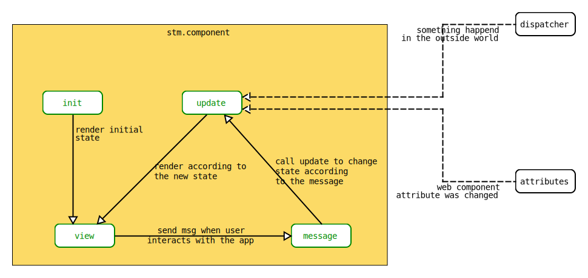

# sw-lib

## Table of Contents

- web-components
    - [sw-button](#sw-button)
    - [sw-loader](#sw-loader)
    - [sw-number-input](#sw-number-input)
    - [sw-pagination](#sw-pagination)
    - [sw-table](#sw-table)
    - [sw-text-input](#sw-text-input)
- utils
    - [sw-flash-message](#sw-flash-message)
    - [sw-modal](#sw-modal)

<a name="sw-button"></a>

## sw-button

### HTML

To use a component provide the tag `sw-button` with required attributes:

- `icon` -
- `disabled` -

Example of use:

```html
<sw-button
        icon="magnifier"
        disabled="false">
</sw-button>
```

### CSS

You can style the component changing the following options in the `:host` selector:

- `--foreground-color`
- `--primary-color-70`
- `--primary-color-40`
- `--primary-color-100`


- Example of use:

```css
:host {
    --foreground-color: white;
    --primary-color-70: rgba(98, 191, 124, .7);
    --primary-color-40: rgba(98, 191, 124, .4);
    --primary-color-100: rgba(98, 191, 124, 1);
}
```

<a name="sw-modal"></a>

## sw-modal

### JS

To use the sw-modal call the `modal()` function, which takes an object as an argument. The object should contain the following keys:

- `header` - can be a `string` or a `function({ close }):string` or a `function({ close }):JSX` or `JSX`
- `body` - can be a `string` or a `function({ close }):string` or a `function({ close }):JSX` or `JSX`
- `footer` - can be a `string` or a `function({ close }):string` or a `function({ close }):JSX` or `JSX`
- `large` - `boolean`

The object cannot be specified without any parameters.

Example of use:

```jsx
const result = await modal({
    header: 'Welcome',
    body: <p>Lorem ipsum dolor sit amet, consectetur adipisicing elit.</p>,
    footer: ({ close }) => <sw-button onClick={() => close(true)}>OK</sw-button>,
    large: true
})
```

### CSS

You can style the component changing the following options in the `:host` selector on your index.html:

- `--background-color` - modal background color
- `--radius` - modal border radius

Example of use:

```css
:host {
    --background-color: ghostwhite;
    --radius: 5px;
}
```
## STM - State Manager

`stm` is a state manager for preact. It's main concept is borrowed from ELM Architecture, although it differs in many edge cases. The goal of an `stm` is to create a web component which could be plugged into any other framework. Conceptually this is how data flows in `stm`:




